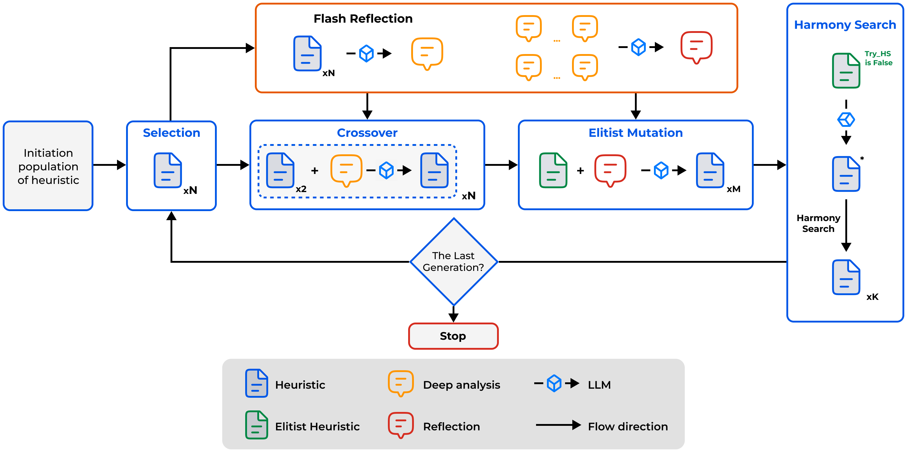

# HSEvo: Elevating Automatic Heuristic Design with Diversity-Driven Harmony Search and Genetic Algorithm Using LLMs

Welcome to **HSEvo** — the code implementation from the paper:
[**HSEvo: Elevating Automatic Heuristic Design with Diversity-Driven Harmony Search and Genetic Algorithm Using LLMs**](https://arxiv.org/abs/2412.14995).

We don’t just talk the talk (in large language models), we walk the walk (in evolutionary leaps).

---

## Table of Contents
- [News 📰](#news-)
- [Overview 💡](#overview-)
- [HSEvo Framework 🏗](#hsevo-framework-)
- [Shannon–Wiener Diversity Index and the Cumulative Diversity Index 🎨](#shannonwiener-diversity-index-and-the-cumulative-diversity-index-)
- [How to use? 🔧](#how-to-use-)
  - [HSEvo Framework 🏗](#hsevo-framework-sub)
  - [How to setup HSEvo for your problem 🏹](#how-to-setup-hsevo-for-your-problem-)
  - [Shannon–Wiener Diversity Index and the Cumulative Diversity Index 🎨](#shannonwiener-diversity-index-and-the-cumulative-diversity-index-details-)
- [Citation 📚](#citation-)
- [References 🔗](#references-)

---

## News 📰
- **Dec. 2024**: We are excited to release the codebase of **HSEvo**.

- **Dec. 2024**: 🎉 HSEvo: Elevating Automatic Heuristic Design with Diversity-Driven Harmony Search and Genetic Algorithm Using LLMs has been accepted at **AAAI 2025**.

---

## Overview 💡
In summary, our contributions are as follows:

- **Two diversity measurement metrics**: The **Shannon–Wiener Diversity Index (SWDI)** and the **Cumulative Diversity Index (CDI)**, to evaluate the evolutionary progress of populations within the LLM-EPS framework.
- **A novel framework, HSEvo**: That aims to balance between the diversity and objective performance to improve the optimization process (and your happiness levels).

This repo (besides the **HSEvo**) also includes setups for other baselines: **EoH**, **FunSearch**, **ReEvo**.  

These can solve various problems, such as:
- **Traveling Salesman Problem (TSP)**
- **Capacitated Vehicle Routing Problem (CVRP)**
- **Orienteering Problem (OP)**
- **Multiple Knapsack Problems (MKP)**
- **Bin Packing Problem (BPP)**

… through different approaches/solvers like:
- **Ant Colony Optimization (ACO)**
- **Guided Local Search (GLS)**
- **Constructive Heuristics** 

---

## HSEvo Framework 🏗


LLM-based Evolutionary Program Search (LLM-EPS) revolutionizes Automatic Heuristic Design (AHD) by combining Large Language Models (LLMs) with evolutionary computation. This approach enables the exploration of heuristic search spaces as functional programs, addressing the critical balance between exploration and exploitation in solving NP-hard combinatorial problems. Frameworks like FunSearch, EoH, and ReEvo have demonstrated the potential of LLM-EPS in diverse optimization tasks.

HSEvo advances LLM-EPS by outperforming FunSearch, EoH, and ReEvo in benchmarks like Bin Packing Problem (BPP), Orienteering Problem (OP), and Traveling Salesman Problem (TSP). Its integration of diversity-driven harmony search and flash reflection achieves superior objective scores and high diversity indices. Notably, HSEvo excels in optimizing solver phases and constructing heuristics, delivering substantial improvements across all evaluated tasks.

---

## Shannon–Wiener Diversity Index and the Cumulative Diversity Index 🎨

**Shannon–Wiener Diversity Index (SWDI):**
The SWDI measures population diversity at a specific moment, assessing how evenly individuals are distributed across clusters in the search space. Higher values promote exploration, while lower values indicate over-concentration, helping balance exploration and exploitation to avoid premature convergence.

**Cumulative Diversity Index (CDI):**
The CDI evaluates overall population diversity across the entire search process. Using a minimum spanning tree (MST) of vector representations, it reflects the cumulative spread of solutions. Higher CDI values ensure robust exploration and prevent excessive convergence on local optima.

**Key insight:**
SWDI captures diversity at specific points, while CDI aggregates it over time. Together, they provide a detailed view of diversity dynamics for effective search strategy design.

---

## How to use? 🔧

### HSEvo Framework 🏗
<span id="hsevo-framework-sub"></span>

1. **Install the dependencies**:

   ```bash
   pip install -r requirements.txt
   ```

2. **Set your LLM API key** corresponding to the chosen LLM provider. More details are available at [litellm.ai docs](https://docs.litellm.ai/docs/providers). 

3. **Run HSEvo**:
   
   ```bash
   python main.py \
       algorithm=... \
       problem=... \
       model=... \
       temperature=... \
       max_fe=... \
       pop_size=... \
       init_pop_size=... \
       mutation_rate=... \
       timeout=... \
       hm_size=... \
       hmcr=... \
       par=... \
       bandwidth=... \
       max_iter=...
   ```

Where:
   - **algorithm**: The chosen algorithm `["hsevo", "reevo", "eoh", "reevo-hs", "reevo-rf"]` (`reevo-hs` is `reevo` enhanced with harmony search, `reevo-rf` is `reevo` where short-term & long-term reflection are replaced by flash reflection; Read our paper for detailed information.)
   - **model**: The LLM model name used to generate heuristics. See all model support at [litellm.ai docs](https://docs.litellm.ai/docs/providers).
   - **temperature**: The temperature for the LLM’s text generation.  
   - **max_fe**: The maximum number of function evaluations for LLM-EPS framework.  
   - **timeout**: The time budget (in seconds) for evaluating a single heuristic.  

Genetic algorithm params:
   - **pop_size**: The population size for the genetic algorithm.  
   - **init_pop_size**: The initial population size for the genetic algorithm.  
   - **mutation_rate**: Probability of mutating an individual in each generation.

Harmony search params:
   - **hm_size**: The size of the Harmony Memory (HM).  
   - **hmcr**: The Harmony Memory Consideration Rate.  
   - **par**: The Pitch Adjusting Rate.  
   - **bandwidth**: The bandwidth used during pitch adjustment.  
   - **max_iter**: The maximum number of iterations for the Harmony Search (or the main loop).  

Check out `./cfg/` for more information.

   **Example**:

   ```bash
   python main.py \
       algorithm=hsevo \
       model=openai/gpt-4o-mini-2024-07-18 \
       problem=bpp_online \
       init_pop_size=30 \
       max_fe=450
   ```

   **Notes**:
   - By default, logs of the processes and intermediate results are stored in `./outputs/main/`.
   - Datasets are created dynamically.
   - To execute FunSearch, visit [`./baselines/funsearch`](/baselines/funsearch/).

---

### How to setup HSEvo for your problem 🏹
<span id="how-to-setup-hsevo-for-your-problem-"></span>

1. Define your problem in `./cfg/problem/`.
2. Generate problem instances and implement the evaluation pipeline in `./problems/`.
3. Add `function_description`, `function_signature`, and `seed_function` in `./prompts/`.

- The LLM-generated heuristic is written into `./problems/YOUR_PROBLEM/gpt.py`, and is imported by `./problems/YOUR_PROBLEM/eval.py`.
- In "training mode", `./problems/YOUR_PROBLEM/eval.py` should **print out** the **meta-objective value** as the last line of stdout. This output is then parsed by `hsevo.evaluate_population` for heuristic evaluation.

---

### Shannon–Wiener Diversity Index and the Cumulative Diversity Index 🎨
<span id="shannonwiener-diversity-index-and-the-cumulative-diversity-index-details-"></span>

For anyone who loves analyzing population diversity, check out [**`Diversity_analysis.ipynb`**](/Diversity_analysis.ipynb).


---

## Citation 📚
<span id="citation-"></span>

If you encounter any difficulty using our code, please do not hesitate to submit an issue or directly contact us.

If you find our work helpful, please give us a star ⭐ on GitHub and cite our paper:

```bibtex
@inproceedings{dat2025hsevo,
    title={HSEvo: Elevating Automatic Heuristic Design with Diversity-Driven Harmony Search and Genetic Algorithm Using LLMs}, 
    author={Pham Vu Tuan Dat and Long Doan and Huynh Thi Thanh Binh},
    booktitle={The 39th Annual AAAI Conference on Artificial Intelligence},
    year={2025},
    note={\url{https://github.com/datphamvn/HSEvo}}
}
```

---

## References 🔗
<span id="references-"></span>

We stand on the shoulders of giants (and a few large language models). Our work is built upon the following projects:

- [Towards Understanding the Effectiveness of Automatic Heuristic Design with Large Language Models](https://github.com/zhichao-lu/llm-eps)
- [ReEvo](https://github.com/ai4co/reevo)  
- [EoH](https://github.com/FeiLiu36/EoH) 
- [FunSearch](https://github.com/google-deepmind/funsearch)  
- [Algorithm Evolution Using Large Language Model](https://arxiv.org/abs/2311.15249)  
- [DeepACO](https://github.com/henry-yeh/DeepACO)  